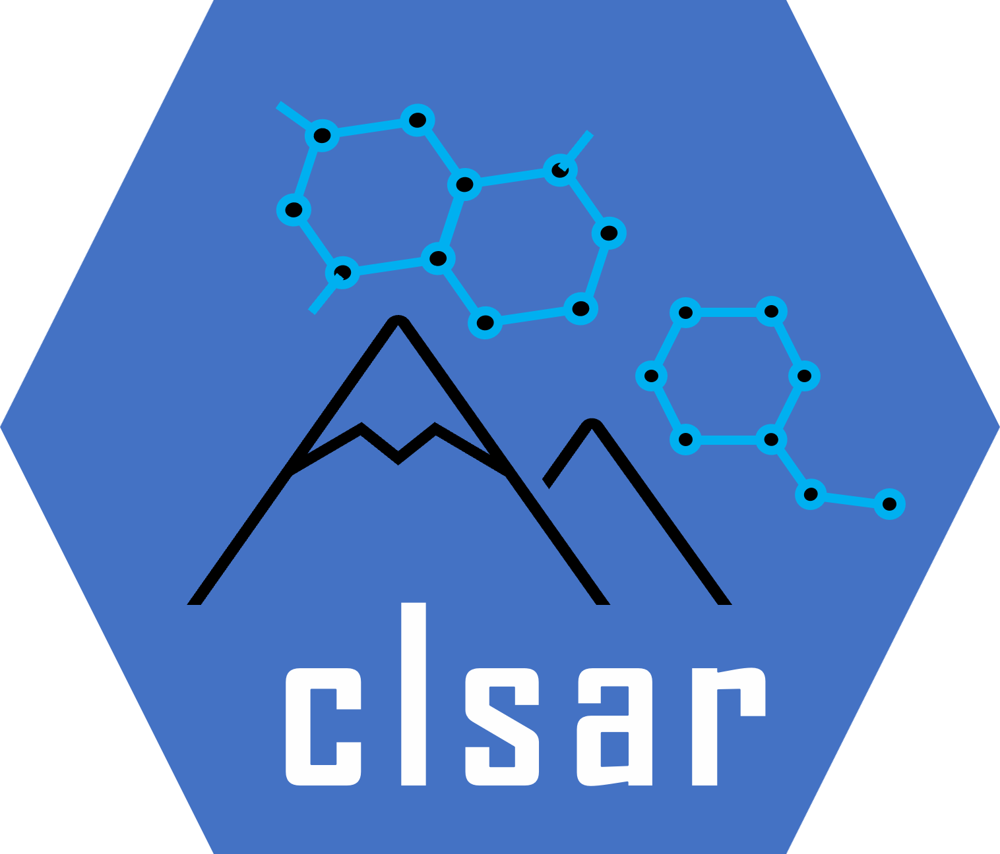
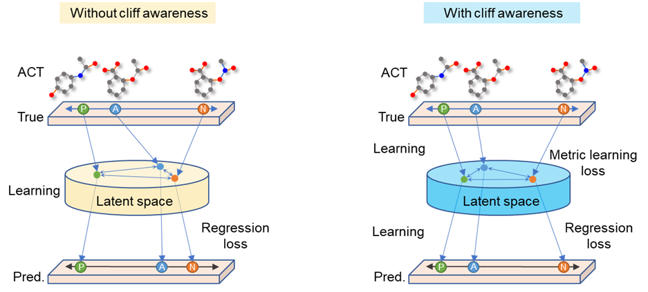
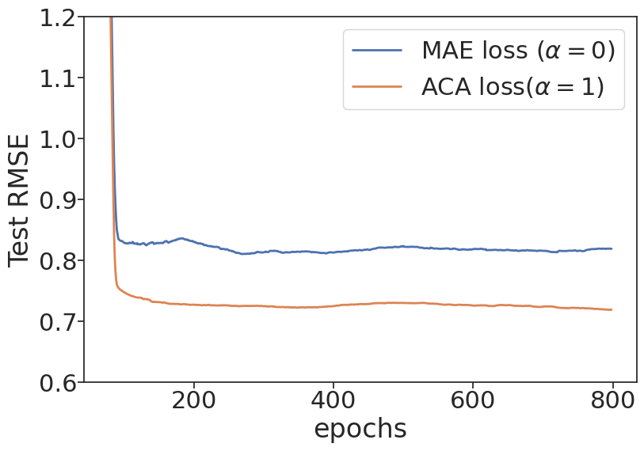
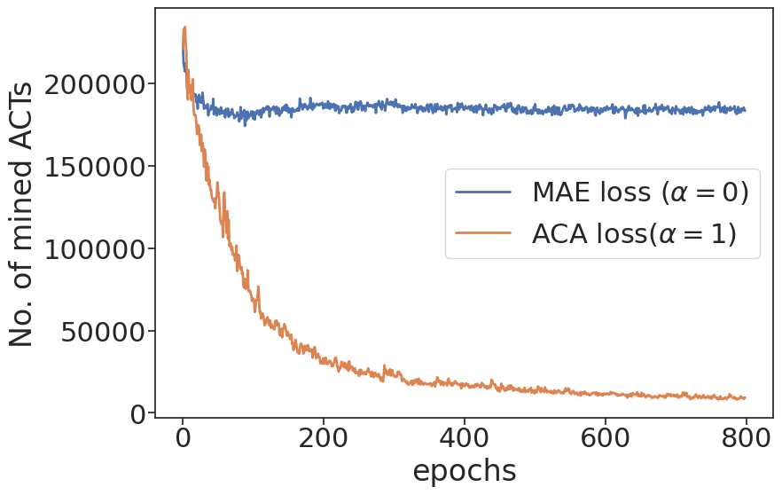

<a href="url"></a>

[](https://codeocean.com/capsule/8102819/tree/v1)


# CL-SAR
Contrastive learning of structure-activity relationship stduies (SAR)

Online triplet contrastive learning enables efficient cliff awareness in molecular activity prediction

------

## About
```math
$$\mathcal{L}_{aca}=\mathcal{L}_{mae}+{a\ast\mathcal{L}}_{tsm}$$
```


This study proposes the activity-cliff-awareness (ACA) loss for improving molecular activity prediction by deep learning models. The ACA loss enhances both metric learning in the latent space and task learning in the target space during training, making the network aware of the activity-cliff issue. For more details, please refer to the paper titled "Online triplet contrastive learning enables efficient cliff awareness in molecular activity prediction."

<p align="left" width="65%">
    
</p>

**Comparison of models for molecular activity prediction, one without (left) and one with (right) activity cliff awareness (ACA).**
The left panel depicts a model without ACA, where the presence of an activity cliff triplet (A, P, N) creates a challenge for the model to learn in the latent space. Due to the similarity between A and N in their chemical structures, the model learns graph representations that result in the distance between A-P being far greater than A-N, leading to poor training and prediction results. However, the right panel shows a model with ACA that optimizes the latent vectors in the latent space, making A closer to P and further away from N. The model with ACA combines metric learning in the latent space with minimizing the error for regression learning, while the model without ACA only focuses on the regression loss and may not effectively handle activity cliffs. 


## Performance

ACA loss vs. MAE loss on external test set and on No. of mined triplets during the training:
<p align="left" width="100%">
    
    
</p>

More details on usage and performance can be found [here](https://github.com/bidd-group/bidd-clsar/blob/main/experiment/00_test/04_test_loss_HSSMS.ipynb).


## ACA loss implementation

* [Pytorch](https://github.com/bidd-group/bidd-clsar/blob/main/clsar/model/loss.py)
* [Tensorflow 2.x](https://github.com/bidd-group/bidd-clsar/blob/main/clsar/model/loss_tf.py)


## ACA loss usage 
```python

#Pytorch
from clsar.model.loss import ACALoss
aca_loss = ACALoss(alpha=0.1, cliff_lower = 0.2, cliff_upper = 1.0, p = 1., squared = False)
loss = aca_loss(labels,  predictions, embeddings)
loss.backward()


#Tensorflow
from clsar.model.loss_tf import ACALoss

```


## Installation

```bash
pip install clsar
```


## Run ACANet

```python
from clsar import ACANet
#Xs_train: list of SMILES string of training set
#y_train_pIC50: the pChEMBL labels of training set

## init ACANet
clf = ACANet(gpuid = 0,   work_dir = './')

## get loss hyperparameters by training set 
dfp = clf.opt_cliff_by_cv(Xs_train, y_train_pIC50, total_epochs=50, n_repeats=3)
dfa = clf.opt_alpha_by_cv(Xs_train, y_train_pIC50, total_epochs=100, n_repeats=3)


## cross-validation fit
clf.cv_fit(Xs_train, y_train_pIC50, verbose=1)


## 5FCV predict and convert pIC50 to y
test_pred_pIC50 = clf.cv_predict(Xs_test)
```


## Citation

Wan Xiang Shen*, Chao Cui*, Xiang Cheng Shi, et al. `Online triplet contrastive learning enables efficient cliff awareness in molecular activity prediction` [J]. ChemRxiv Pub Date : 2023-05-29 , DOI: 10.26434/chemrxiv-2023-5cz7s.

