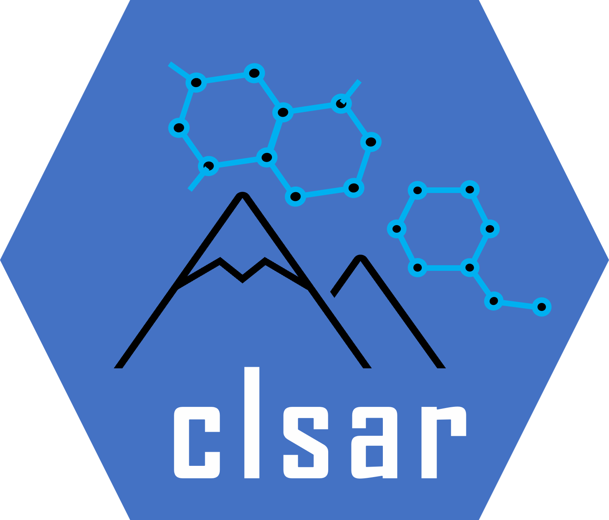

<a href="url"></a>
# CL-SAR
Contrastive learning of structure-activity relationship


# installation


```bash
conda create -c conda-forge -n clsar rdkit
conda activate clsar
pip install -r ./requirements.txt 
```
import os
import os.path as osp
import re

import torch
from torch_geometric.data import (InMemoryDataset, Data, download_url,
                                  extract_gz)
```